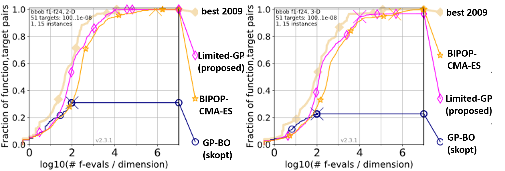

# About
Limited-GP is a fast variant of Bayesian Optimization with Gaussian Process that is a black box optimization algorithm for functions on continuous search space. Limited-GP costs constant time per iteration while naive gaussian process costs cubically.

Please refer to our [Japanese blog post](https://research.preferred.jp/2019/10/limited-gp/) for the details of this algorithm.


# Benchmark

We use [COCO (COmparing Continuous Optimisers)](https://coco.gforge.inria.fr/) to test the performance of Limited-GP.

#### installation of COCO

The following commands install python modules `cocoex` and `cocopp`:

```console
$ git clone https://github.com/numbbo/coco.git
$ cd coco
$ pip install numpy scipy tqdm matplotlib
$ python do.py run-python
$ python do.py install-postprocessing
```


#### testing

```console
$ ./run.sh
```

Results will be outputted to directory `exdata/`.


#### drawing graph

```console
$ python -m cocopp -o results exdata/*
```

You can download the results of algorithms used for the past COCO contests and compare them with Limited-GP:

```console
// Compare Limited-GP and BIPOP-CMA-ES.
$ curl -L http://coco.gforge.inria.fr/data-archive/bbob/2009/BIPOP-CMA-ES_hansen_noiseless.tgz -o BIPOP-CMA-ES.tar.gz
$ tar zxvf BIPOP-CMA-ES.tar.gz
$ python -m cocopp -o results exdata/* BIPOP-CMA-ES
```

## Result


<br>

The pink line shows the result of our method, and the yellow line shows BIPOP-CMA-ES, which is one of the most competitive method in the past contest.
